# 💚 TrustFund

<div align="center">

### Trusted Giving, Real Impact

A modern full-stack donation and fundraising platform that connects verified charities, generous donors, and committed volunteers — with every rupee tracked from donation to impact through secure authentication, role-based dashboards, and an honest, transparent giving experience.


</div>

<p align="center">
  <a href="https://trustfund-i8r1.onrender.com" target="_blank" rel="noopener noreferrer">🔗 Live Demo</a>
</p>

<p align="center">
  
</p>

## 📖 Project Overview

TrustFund is a full-stack **donation and fundraising platform** that rebuilds trust in online giving. Donors discover **verified charities** and **active campaigns**, give securely through the **Razorpay payment gateway**, download numbered PDF receipts, and follow their money all the way to impact. Charities manage their organization, verification documents, fundraising campaigns, progress updates, and volunteer opportunities from one dedicated workspace. Volunteers find and join real-world opportunities posted by genuine organizations.

The platform solves the persistent **trust gap in online giving**:

- **Donors** cannot easily tell which organizations are legitimate or where their money goes.
- **Charities** lack ready-made tooling for campaigns, donor communication, receipts, and volunteer coordination.
- **Volunteers** have no central place to discover opportunities posted by verified organizations.
- **Everyone** lacks visible, verifiable proof of impact — receipts, updates, and transparent financial totals.

TrustFund answers this with a **documented charity verification workflow**, enforced campaign lifecycles, atomic payment settlement with idempotency, automatic numbered receipts, and dedicated role-gated workspaces for donors, charities, volunteers, and admins. Built with **Django, Django REST Framework, React, and PostgreSQL**, it demonstrates a production-grade implementation of JWT authentication, RESTful APIs, role-based access control, payment webhooks, PDF generation, and responsive web design — all inside a thoughtfully designed interface.

---

## ✨ Key Features

| Area | Feature | What it does | Why it matters |
|------|---------|--------------|----------------|
| 🔐 **Authentication** | Email + password sign-up / login | JWT access/refresh tokens with rotation and blacklisting | Secure, stateless, revocable sessions |
| | Role-gated registration | Users register explicitly as a DONOR, CHARITY, or VOLUNTEER (ADMIN registration is blocked) | Clear identity from the very first sign-up |
| 🏛️ **Charity Verification** | Documented verification workflow | Organization profiles move through `PENDING → VERIFIED → REJECTED` with submit/review/reject/resubmit endpoints | Charities must prove legitimacy before they can raise funds |
| | Full audit trail | Every verification action is recorded in a `verification_logs` table | Complete accountability for every approval decision |
| 🎯 **Campaign Management** | Validated campaign lifecycle | `DRAFT → ACTIVE → COMPLETED / EXPIRED / CANCELLED` with enforced transitions | Terminal states are final — no moving the goalposts |
| | Verified-only fundraising | Only owners of **verified** charities can publish ACTIVE campaigns | The public feed is gated behind real legitimacy |
| | Public discovery feed | Search, category filter, and sort over active campaigns | Donors find causes that match their values |
| 💳 **Payments & Donations** | Secure Razorpay checkout | Server-side order creation, signature verification, and webhook handling | Payment integrity guaranteed end to end |
| | Atomic, idempotent settlement | `raised_amount` updated with `F()` + `select_for_update` inside a transaction; idempotency keys prevent double-counting | Retries and duplicate webhooks can never inflate totals |
| 🧾 **Receipts** | Automatic numbered PDF receipts | ReportLab generates a unique `TRF-YYYYMMDD-XXXXXX` receipt for every successful donation | Donors get an auditable record of each contribution |
| 🙋 **Volunteers** | Opportunity publishing & applications | Charities post opportunities; volunteers apply with a statement; statuses tracked per side | Real-world engagement beyond just money |
| 🔔 **Notifications** | Typed in-app notifications | Donation, milestone, update, volunteer, and receipt notifications with duplicate protection | Donors and charities stay informed without email spam |
| 📊 **Dashboards & Analytics** | Role-specific dashboards | Donor, charity, and admin dashboards plus a public analytics endpoint | Every role sees the numbers that matter to them |
| 🛠️ **Admin Console** | System-wide management | Admin UI for charity verifications, users, organizations, campaigns, donations, and audit logs | Trust radiation — the verification process is transparent |

---

## 📸 Screenshots

### 🏠 Home / Platform Overview

The landing page opens with the product promise — *"Every gift, verified. Every rupee, accounted for."* — an animated hero, clear calls to action, and a preview of verified charities and active campaigns.

<p align="center">
  
</p>

---

### 🎯 Campaign Discovery

The public discovery feed lists active campaigns from verified charities, with search, category filtering, and sorting — each card surfacing the charity, its goal, the current raised total, and progress.

<p align="center">
  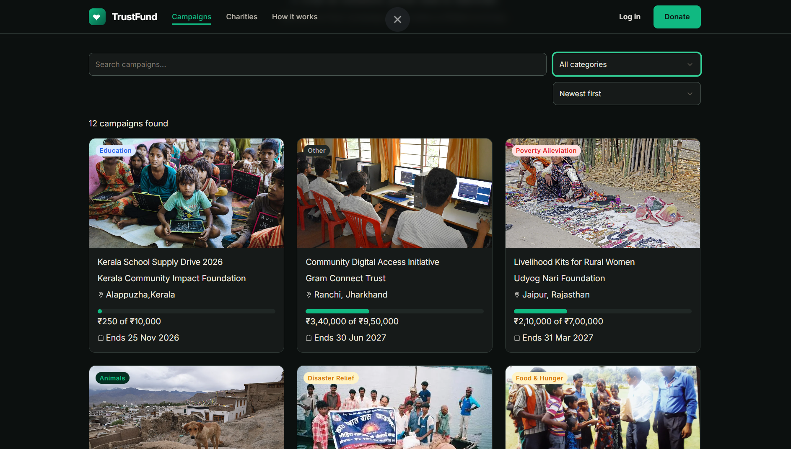
</p>

---

### 🏛️ Verified Charities

Browse the directory of verified charity organizations — each with its mission, location, and proof of verification before it can raise funds.

<p align="center">
  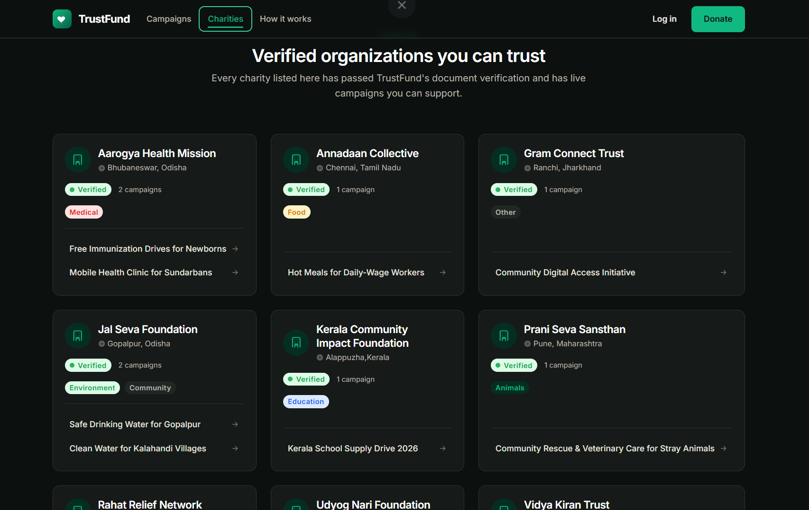
</p>

---

### 👤 Donor Dashboard

Donors see their lifetime giving, impact summary, and quick access to donations, receipts, and notifications.

<p align="center">
  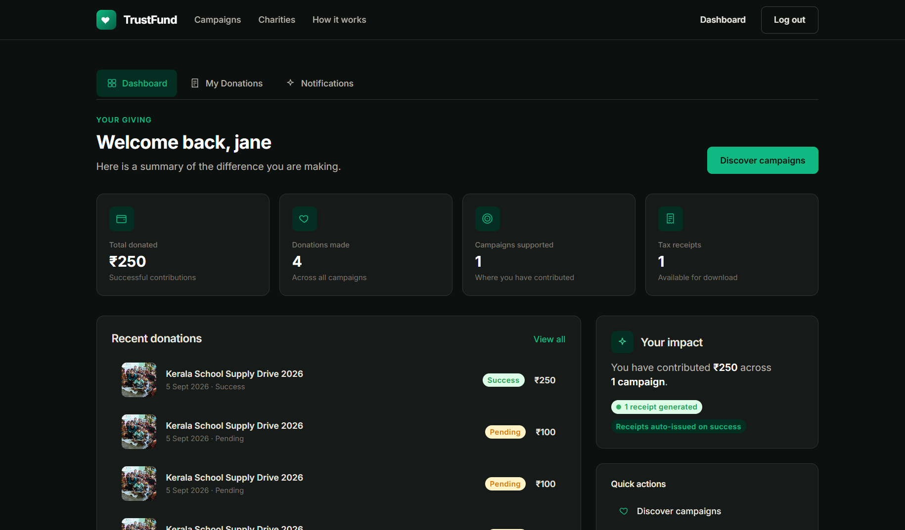
</p>

---

### 🧾 Donation & Receipt

The donation detail view with its payment status and the numbered PDF receipt for every contribution.

<p align="center">
  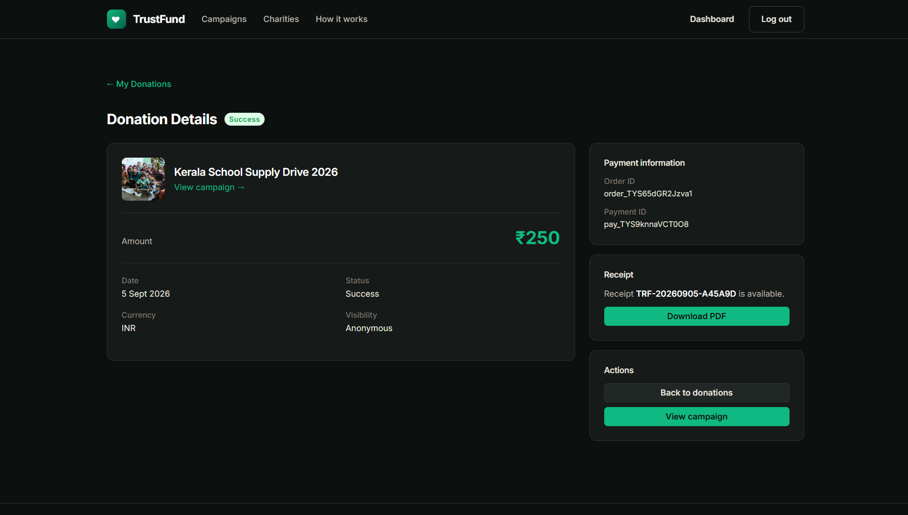
</p>

---

### 🏥 Charity Dashboard

The charity workspace shows funds raised across campaigns, active campaigns, and organization impact at a glance.

<p align="center">
  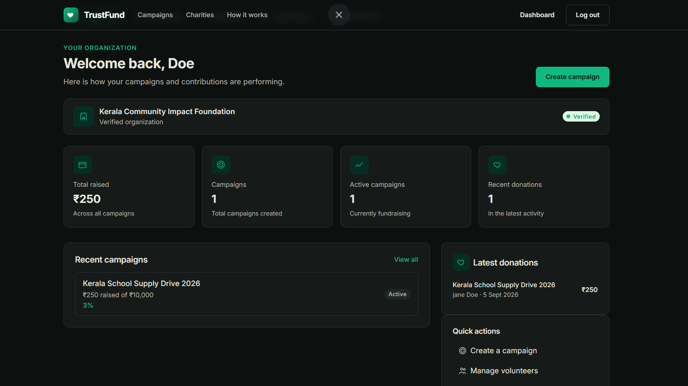
</p>

---

### 🗂️ Campaign Management

Charities create and manage fundraising campaigns and progress updates from one focused workspace.

<p align="center">
  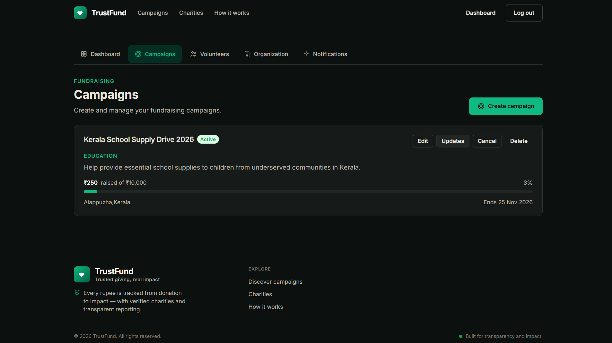
</p>

---

### 🤝 Volunteer Management

Charities publish volunteer opportunities and review applications, with statuses tracked on both sides.

<p align="center">
  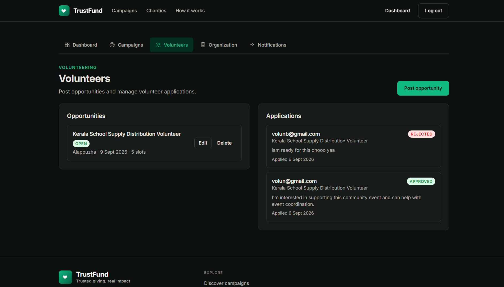
</p>

---

### 🏃 Volunteer Experience

Volunteers discover real-world opportunities posted by verified organizations and apply in a few clicks.

<p align="center">
  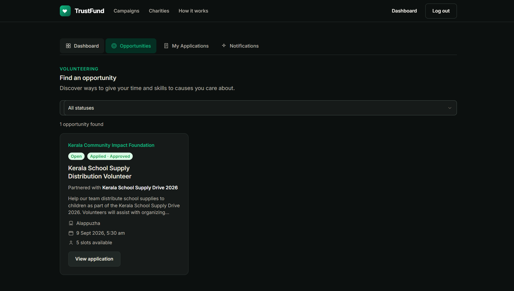
</p>

---

### 📝 Volunteer Applications

Volunteers track their applications through every stage — submitted, approved, rejected, or attended.

<p align="center">
  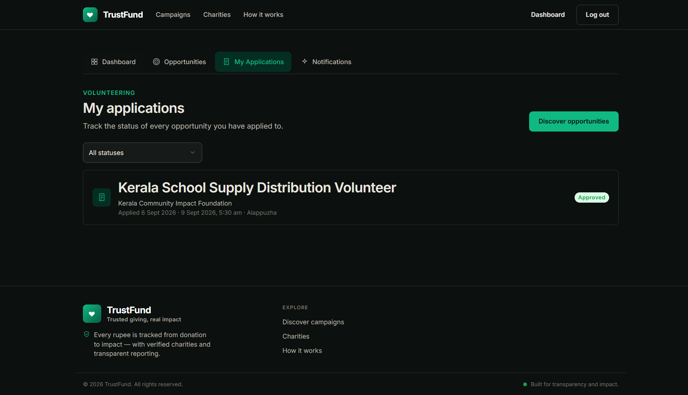
</p>

---

### 🔔 Charity Notifications

Typed in-app notifications keep charity owners informed of donations, campaign updates, and volunteer activity — with duplicate protection.

<p align="center">
  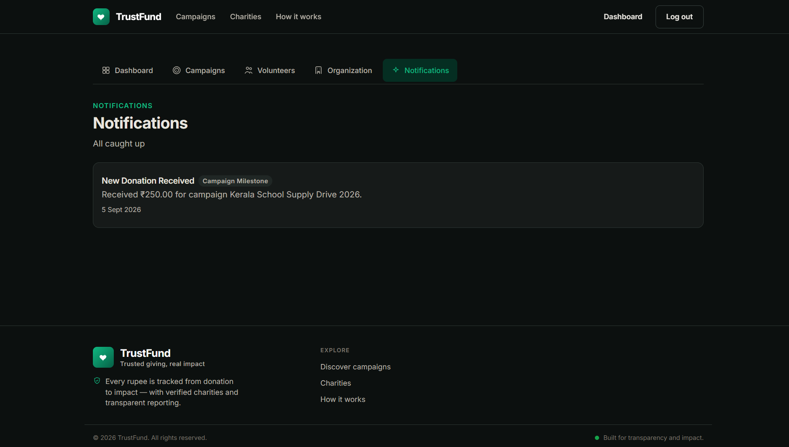
</p>

---

### 🛡️ Administration Dashboard

System-wide oversight of charity verifications, users, organizations, campaigns, donations, and audit logs.

<p align="center">
  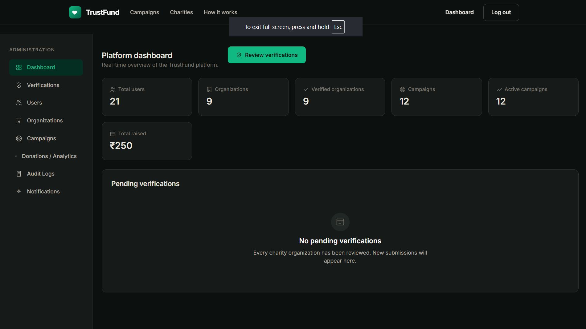
</p>

---

## 🛠️ Technology Stack

| Category | Technology | Purpose |
|----------|-----------|---------|
| **Frontend** | React 19 | Component-based UI |
| | TypeScript 5.7 | Type-safe application code |
| | Vite 6 | Build tooling & dev server |
| | React Router 7 | Client-side routing, protected routes & role gates |
| | Motion | Lightweight UI animation |
| **Backend** | Django 6 | Web framework & ORM |
| | Django REST Framework 3.18 | REST API layer |
| | django-environ | Environment configuration |
| | django-filter | Query filtering for list endpoints |
| | django-cors-headers | Cross-origin resource sharing |
| **Auth** | django-rest-framework-simplejwt 5.5 | JWT access/refresh tokens with rotation + blacklist |
| **Database** | PostgreSQL (via `DATABASE_URL`) | Relational database (Neon in production; SQLite out of the box for local dev) |
| **Async** | Celery 5 + Redis | Background notification dispatch (retrying, broker-aware) |
| **Payments** | Razorpay Python SDK 1.4 | Orders, checkout, signature verification, webhooks |
| **Receipts** | ReportLab 4.1 | Numbered PDF donation receipts |
| **Media** | Cloudinary | Production image storage (optional, disabled by default) |
| **Static / Serving** | WhiteNoise + gunicorn | Production static files & WSGI serving |
| **Testing** | pytest + pytest-django (backend) · Vitest + Testing Library (frontend) | Automated coverage of both tiers |

---

## 🏗️ System Architecture

```text
                React Frontend (Vite + TypeScript)
                              │
                              ▼
              React Router (lazy-loaded, role-gated)
                              │
                              ▼
                Typed API Clients (fetch / JWT store)
                └── 401 interceptor → token refresh / logout
                              │
                              ▼
          Django REST Framework Backend (gunicorn)
                  └── DRF permissions + CORS allow-list
                              │
      ┌──────────────┬─────────┼──────────┬───────────────┐
      ▼              ▼         ▼          ▼               ▼
   Auth          Charities  Campaigns   Donations      Volunteers
 /auth/*        /charities /*          /donations/*   /volunteers/*
(JWT+rotation) (verification) (lifecycle) (Razorpay)  (applications)
      │              │         │          │                │
      │              └─────────┼──────────┼────────────────┘
      │                        ▼          ▼
      │               PostgreSQL    Razorpay API
      │              (Neon / local)  (orders, webhook)
      │                        │          │
      │                        ▼          ▼
      └──────────────►  Celery + Redis   Cloudinary
                     (background jobs)  (prod media)
```

---

## 📂 Project Structure

```text
TrustFund/
│
├── backend/                         # Django REST Framework API
│   ├── config/                      # settings, URL routing, health check, Celery/WSGI entrypoints
│   ├── users/                       # Custom User model, roles, JWT auth, permissions
│   ├── charities/                   # Organizations + verification workflow
│   ├── campaigns/                   # Campaigns, categories, lifecycle, updates
│   ├── donations/                   # Donations, Razorpay orders/webhooks, payment services
│   ├── receipts/                    # Numbered receipts + PDF generation
│   ├── volunteers/                  # Opportunities + applications
│   ├── notifications/               # In-app notifications + Celery tasks
│   ├── admin_api/                   # Admin-facing endpoints (users, audit logs)
│   ├── dashboard/                   # Donor / charity / admin dashboards + analytics
│   ├── requirements.txt
│   ├── build.sh                     # Render build (install, collectstatic, migrate)
│   └── .env.example
│
├── frontend/                        # React + TypeScript single-page app
│   └── src/
│       ├── app/                     # Brand config, central route table
│       ├── components/              # Design-system primitives (button, dialog, form, toast, …)
│       ├── layouts/                 # Site shell, auth layout, app shell, admin shell
│       ├── pages/                   # home, auth, campaigns, donor, charity, volunteer, admin, public
│       │   ├── donor/               # Donation history, details, notifications
│       │   ├── charity/             # Dashboard, organization, campaigns, updates, volunteers
│       │   ├── volunteer/           # Dashboard, opportunities, applications
│       │   ├── admin/               # Dashboard, verifications, users, organizations, campaigns, donations, audit logs
│       │   └── campaigns/           # Discovery, detail, donate, donation success
│       ├── services/                # Typed API clients (auth, campaigns, donations, receipts, admin, …)
│       ├── context/                 # Auth context
│       ├── hooks/                   # Reusable UI hooks
│       └── styles/                  # Design tokens + base/utilities
│
├── trustfund-screenshots/           # README screenshots (home.gif + captured UI views)
├── README.md
├── LICENSE
└── .gitignore
```

---

## ⚙️ Installation & Setup

### 1️⃣ Prerequisites

- **Python** 3.12+ and **pip**
- **Node.js** 18+ and **npm**
- *(Optional)* **PostgreSQL** and **Redis** — not required to get started; SQLite and eager Celery work out of the box.

### 2️⃣ Clone the Repository

```bash
git clone https://github.com/Aby020/TrustFund.git
cd TrustFund
```

### 3️⃣ Set Up the Backend

```bash
cd backend

# Create and activate a virtual environment
python -m venv .venv
# Windows (PowerShell):  .venv\Scripts\Activate.ps1
# macOS / Linux:         source .venv/bin/activate

pip install -r requirements.txt
```

### 4️⃣ Configure Environment Variables

Inside **backend**, copy the example file:

```bash
cd backend
# Windows:  copy .env.example .env
# macOS/Linux: cp .env.example .env
```

The safe defaults (SQLite, eager Celery, no Cloudinary) work without editing. For a full breakdown see [Environment Variables](#-environment-variables).

```env
DEBUG=True
DATABASE_URL=sqlite:///db.sqlite3
REDIS_URL=redis://localhost:6379/0
```

### 5️⃣ Set Up the Database

```bash
cd backend
python manage.py migrate
```

Optionally seed verified charities and their campaigns:

```bash
python manage.py seed_dev_data
```

### 6️⃣ Start the Backend Server

```bash
cd backend
python manage.py runserver
```

Backend runs on:

```
http://localhost:8000
```

The API is served under `http://localhost:8000/api/v1/` with a health check at `GET /healthz/`.

### 7️⃣ Set Up the Frontend

Open a new terminal.

```bash
cd frontend
npm install

# (Optional) copy the frontend env example; defaults target localhost:8000
#   Windows:  copy .env.example .env
#   macOS/Linux: cp .env.example .env
```

### 8️⃣ Start the Frontend

```bash
cd frontend
npm run dev
```

Frontend runs on:

```
http://localhost:3000
```

---

## 🔐 Environment Variables

All secrets are **environment variables** — never committed. The repository ships safe `.env.example` files with placeholders; `.env` itself is git-ignored.

### Backend (`backend/.env.example`)

| Variable | Required | Purpose | Dev default |
|----------|----------|---------|-------------|
| `DEBUG` | Yes | Django debug mode | `True` |
| `SECRET_KEY` | Yes | Django signing key — generate a strong random value for production | placeholder |
| `ALLOWED_HOSTS` | Yes | Comma-separated allowed hostnames | `localhost,127.0.0.1` |
| `DATABASE_URL` | Yes | PostgreSQL connection string (Neon: append `?sslmode=require`) | `sqlite:///db.sqlite3` |
| `REDIS_URL` | Yes | Redis URL (Celery broker) | `redis://localhost:6379/0` |
| `CELERY_BROKER_URL` | Yes | Celery broker URL | `redis://localhost:6379/1` |
| `CELERY_RESULT_BACKEND` | Yes | Celery result backend URL | `redis://localhost:6379/2` |
| `CELERY_TASK_ALWAYS_EAGER` | No | Run Celery tasks synchronously in dev | `True` |
| `CORS_ALLOWED_ORIGINS` | Yes | Frontend origins to allow | `http://localhost:3000,...` |
| `CSRF_TRUSTED_ORIGINS` | Yes | Trusted CSRF origins (must match CORS) | `http://localhost:3000,...` |
| `EMAIL_URL` | Yes | Email backend (`console://` in dev, SMTP in prod) | `console://` |
| `RAZORPAY_KEY_ID` | Yes | Razorpay key ID (test key in development) | placeholder |
| `RAZORPAY_KEY_SECRET` | Yes | Razorpay key secret (test secret in development) | placeholder |
| `RAZORPAY_WEBHOOK_SECRET` | Yes | Razorpay webhook signing secret | placeholder |
| `CLOUDINARY_STORAGE_ENABLED` | No | Enable Cloudinary for production media | `False` |
| `CLOUDINARY_CLOUD_NAME` / `API_KEY` / `API_SECRET` | No* | Cloudinary credentials (*required only if enabled) | empty |
| `SECURE_SSL_REDIRECT` | No | Redirect HTTP to HTTPS (set `True` in production) | `False` |
| `SESSION_COOKIE_SECURE` | No | Only send session cookies over HTTPS | `False` |
| `CSRF_COOKIE_SECURE` | No | Only send CSRF cookies over HTTPS | `False` |

### Frontend (`frontend/.env.example`)

| Variable | Purpose | Dev default |
|----------|---------|-------------|
| `VITE_API_BASE_URL` | Base URL of the Django API | `http://localhost:8000` |
| `VITE_RAZORPAY_KEY_ID` | Razorpay **public** key ID used by checkout | `rzp_test_xxxxxx` |

`VITE_RAZORPAY_KEY_ID` is a **public** key and is safe to include in the Vite build output.

---

## 🚀 Running the Project

1. Start the backend: `cd backend && python manage.py runserver` → `http://localhost:8000`
2. *(Optional)* Start a Celery worker: `cd backend && celery -A config worker -l info`
3. Start the frontend: `cd frontend && npm run dev` → `http://localhost:3000`
4. Open `http://localhost:3000` in your browser.

> Log in as a DONOR, CHARITY, or VOLUNTEER through the registration flow to explore the role-specific workspaces. Donations in development use **Razorpay test keys** — never live credentials outside a protected production environment.

---

## 🔑 Demo Data (Local Seed)

> ⚠️ **Development only.** `python manage.py seed_dev_data` populates a local database with realistic demo data using a single **test-only placeholder password**. It is not real — use it only against your local SQLite/Postgres, never a production database.

| What | Count | Notes |
|------|------:|-------|
| **Verified charity organizations** | 8 | Covering water, education, health, food, relief, animals, poverty, and other causes |
| **Active campaigns** | 11 | Verified charities' campaigns start ACTIVE with goals, locations, and cover images |
| Demo password | 1 | Shared `TEST_ONLY_PASSWORD` placeholder for every seeded charity account |

There is **no default admin credential** — the public registration API deliberately blocks ADMIN sign-up (`Cannot register as admin. Contact system administrator.`). Admin accounts are provisioned by an authorized operator, not through self-registration. If you need admin access locally, create one via the Django shell — never commit the password.

---

## 👥 User Roles

| Capability | 🤝 Donor | 🏥 Charity | 🙋 Volunteer | 🛡️ Admin |
|---|---|---|---|---|
| Browse public campaigns & charities | ✅ | ✅ | ✅ | ✅ |
| Register / log in | ✅ | ✅ | ✅ | ❌ (provisioned) |
| Donate through Razorpay checkout | ✅ | ❌ | ❌ | ✅ |
| Download numbered PDF receipts | ✅ | ❌ | ❌ | ✅ |
| Manage their organization & verification | ❌ | ✅ | ❌ | Review |
| Create & manage campaigns / updates | ❌ | ✅ | ❌ | View |
| Post & review volunteer opportunities | ❌ | ✅ | ❌ | View |
| Apply to volunteer opportunities | ❌ | ❌ | ✅ | ❌ |
| System-wide dashboard & audit logs | ❌ | ❌ | ❌ | ✅ |

Routes are protected by both `ProtectedRoute` (JWT) and `RequireRole` (role check) guards — a donor token cannot reach charity or admin endpoints, and vice versa.

---

## 🔄 Feature Workflow

### 🏛️ Charity Verification Lifecycle

```text
Charity creates organization profile ─► status = PENDING
                                              │
                    Admin reviews documents   │
                          ├── Approve ───────► VERIFIED ─► can raise funds
                          └── Reject ────────► REJECTED (reason required)
                                                     │
                                        Charity fixes & resubmits ─► PENDING
```

Every action (submit / approve / reject / resubmit) is written to the `verification_logs` audit trail.

### 🎯 Campaign Lifecycle

```text
Verified charity creates campaign ──► ACTIVE (public feed)
                                              │
                                      Goal reached / deadline passed
                                              │
                    ┌─────────────────────────┼─────────────────────────┐
                    ▼                         ▼                         ▼
                COMPLETED                 EXPIRED                    CANCELLED
```

`raised_amount` is **owned by the donations domain** — it is never writable through campaign endpoints.

### 💳 Donation & Payment Flow

| Step | Action | Result |
|------|--------|--------|
| 1 | Donor opens a campaign, chooses an amount | Backend validates the campaign is ACTIVE, creates a Razorpay order, stores a `PENDING` donation with a unique idempotency key |
| 2 | Frontend launches Razorpay Checkout | SDK loaded asynchronously; public key from `VITE_RAZORPAY_KEY_ID` |
| 3 | Donor completes payment | Client posts `payment_id` + `signature` |
| 4 | Signature verified | Donation → `SUCCESS`; campaign `raised_amount` incremented **atomically** |
| 5 | Webhook arrives (`payment.captured` / `order.paid`) | Signature-verified and idempotent — a duplicate simply no-ops |
| 6 | Receipt generated & donor notified | Numbered PDF + in-app notification |

### 🙋 Volunteer Workflow

```text
Charity publishes opportunity ──► Volunteer applies with a statement
                                        │
                      Charities review applications
                    ┌──────────────────┼──────────────────┐
                    ▼                  ▼                  ▼
                APPROVED           REJECTED            ATTENDED
```

A volunteer can apply to each opportunity only once. Both sides receive notifications on status changes.

---

## 🔌 API Overview

All routes are served under `/api/v1/` and return JSON. Mutating routes validate payloads and enforce object-level authorization. Protected endpoints require a `Authorization: Bearer <access-token>` header.

### 🔐 Authentication — `/api/v1/auth/`

| Method | Endpoint | Description | Auth |
|--------|----------|-------------|------|
| `POST` | `/auth/register/` | Register as DONOR, CHARITY, or VOLUNTEER | — |
| `POST` | `/auth/login/` | Sign in, returns access + refresh JWT pair | — |
| `POST` | `/auth/refresh/` | Rotate the access token | Refresh token |
| `POST` | `/auth/logout/` | Revoke the session (blacklist) | ✅ |
| `GET` | `/auth/me/` | Current user profile & role | ✅ |

### 🏛️ Charities — `/api/v1/charities/`

| Method | Endpoint | Description | Auth |
|--------|----------|-------------|------|
| `GET` | `/charities/` | Public list of verified charities | — |
| `GET` | `/charities/<id>/` | Charity details | — |
| `POST` | `/charities/create/` | Create an organization profile | CHARITY |
| `GET` | `/charities/me/` | My organization | CHARITY |
| `POST` | `/charities/<id>/submit/` | Submit for verification | CHARITY |
| `POST` | `/charities/<id>/approve/` | Approve verification | Admin |
| `POST` | `/charities/<id>/reject/` | Reject verification (reason required) | Admin |
| `POST` | `/charities/<id>/resubmit/` | Resubmit after rejection | CHARITY |
| `GET` | `/charities/<id>/history/` | Verification audit trail | Admin / Owner |

### 🎯 Campaigns — `/api/v1/campaigns/`

| Method | Endpoint | Description | Auth |
|--------|----------|-------------|------|
| `GET` | `/campaigns/` | Discovery feed (search, category, sort) | — |
| `GET` | `/campaigns/<id>/` | Campaign detail | — |
| `POST` | `/campaigns/` | Create a campaign (verified charity) | CHARITY |
| `PATCH` | `/campaigns/<id>/` | Update own campaign | CHARITY |
| `GET` / `POST` | `/campaigns/updates/` | Global campaign updates | — / Auth |
| `GET` / `POST` | `/campaigns/<id>/updates/` | Updates for one campaign | — / CHARITY |

### 💳 Donations — `/api/v1/donations/`

| Method | Endpoint | Description | Auth |
|--------|----------|-------------|------|
| `POST` | `/donations/` | Initialize a donation (creates Razorpay order) | ✅ |
| `GET` | `/donations/` | My donation history | ✅ |
| `POST` | `/donations/<id>/verify_payment/` | Verify signature & settle donation | ✅ |
| `POST` | `/donations/webhook/` | Razorpay webhook (idempotent) | Signature |

### 🧾 Receipts — `/api/v1/receipts/`

| Method | Endpoint | Description | Auth |
|--------|----------|-------------|------|
| `GET` | `/receipts/` | My receipts | ✅ |
| `GET` | `/receipts/<id>/` | Receipt detail | ✅ |
| `GET` | `/receipts/<id>/download_pdf/` | Download the numbered PDF receipt | ✅ |

### 🙋 Volunteers — `/api/v1/volunteers/`

| Method | Endpoint | Description | Auth |
|--------|----------|-------------|------|
| `GET` | `/volunteers/opportunities/` | Open opportunities | — |
| `POST` | `/volunteers/opportunities/` | Publish an opportunity | CHARITY |
| `GET` / `POST` | `/volunteers/applications/` | List / create applications | ✅ / VOLUNTEER |
| `PATCH` | `/volunteers/applications/<id>/` | Update application status | CHARITY |

### 📊 Dashboards & Admin — `/api/v1/`

| Method | Endpoint | Description | Auth |
|--------|----------|-------------|------|
| `GET` | `/dashboard/donor/` | Donor impact & lifetime giving | DONOR |
| `GET` | `/dashboard/charity/` | Charity funds raised across campaigns | CHARITY |
| `GET` | `/dashboard/admin/` | System-wide metrics | Admin |
| `GET` | `/dashboard/analytics/` | Public analytics (donations by category, success rates) | — |
| `GET` | `/admin/users/` | Admin user directory | Admin |
| `GET` | `/admin/audit-logs/` | Admin audit log | Admin |
| `GET` | `/notifications/` | My notifications | ✅ |

**Example — login and use a protected endpoint:**

```bash
# 1. Obtain tokens
curl -X POST https://trustfund-backend-jexv.onrender.com/api/v1/auth/login/ \
  -H "Content-Type: application/json" \
  -d '{"email":"you@example.com","password":"your-password"}'

# 2. Call a protected endpoint with the access token (exported as $TOKEN)
curl https://trustfund-backend-jexv.onrender.com/api/v1/auth/me/ \
  -H "Authorization: Bearer $TOKEN"
```

---

## 🗄️ Database Overview

The schema is organized into per-domain Django apps, all reconciled through `python manage.py migrate`. PostgreSQL is used in production (`DATABASE_URL`); SQLite works out of the box locally.

| App | Core models | Purpose |
|-----|-------------|---------|
| **users** | `User` | Custom user with email login and a mandatory `role` field (`DONOR \| CHARITY \| VOLUNTEER \| ADMIN`) |
| **charities** | `CharityOrganization`, `VerificationLog` | Organization profiles + the `PENDING → VERIFIED / REJECTED` workflow with full audit history |
| **campaigns** | `Campaign`, `CampaignCategory`, `CampaignUpdate` | Fundraising campaigns with enforced lifecycle, goals, locations, and progress updates |
| **donations** | `Donation` | Payments with status, idempotency key, Razorpay references, and atomic settlement |
| **receipts** | `Receipt` | Numbered receipts (`TRF-YYYYMMDD-XXXXXX`) linked to successful donations |
| **volunteers** | `VolunteerOpportunity`, `VolunteerApplication` | Opportunities + applications with a per-opportunity uniqueness rule |
| **notifications** | `Notification` | Typed in-app notifications with duplicate protection |
| **dashboard / admin_api** | — (query/aggregation only) | Role analytics and admin-facing reads |

Key integrity rules enforced at the database layer:

```text
Campaign.goal_amount  > 0                        (check constraint)
Campaign.raised_amount  not user-writable         (owned by donations domain)
VolunteerApplication  unique (volunteer, opportunity)
Donation.idempotency_key  unique                 (webhook/retry safety)
Charity verification  only admins approve/reject  (a charity cannot verify itself)
```

---

## 🔒 Security Features

| Feature | Implementation |
|---------|----------------|
| **JWT authentication** | Access/refresh token pair from SimpleJWT with **rotation and blacklisting** |
| **Deny-by-default authorization** | DRF default is `IsAuthenticated`; public read endpoints opt in explicitly |
| **Role-based access control** | Frontend `RequireRole` guards + backend role/permission checks on every endpoint |
| **Object-level authorization** | Charities manage only their own org/campaigns; verification approve/reject is admin-only |
| **Password hashing** | Django password hashers — nothing stored in plaintext |
| **Payment integrity** | Server-side signature verification for checkout **and** webhooks; idempotency keys; `F()` + `select_for_update` atomic `raised_amount` updates |
| **Secure secrets** | `SECRET_KEY`, `DATABASE_URL`, Razorpay, and Cloudinary credentials read from environment only |
| **Secure cookies in production** | `SESSION_COOKIE_SECURE`, `CSRF_COOKIE_SECURE`, `SECURE_SSL_REDIRECT`, and `SECURE_PROXY_SSL_HEADER` enabled behind the Render TLS proxy |
| **No secrets in code** | `.env` is git-ignored; only placeholder `.env.example` files are tracked |

---

## 🚀 Future Enhancements

- 🤖 **ML / Intelligence Layer** — donation-trend analytics, smart campaign recommendations, anomaly detection, and fraud signals *(planned, not yet implemented)*
- 💳 **Recurring donations** — scheduled giving and one-tap repeat donations
- 🧾 **Region-specific receipts** — India / U.K. tax-receipt formatting
- 🌍 **Richer campaign discovery** — location, impact tags, and advanced filters
- 📈 **Verified impact reporting** — per-campaign impact stories and public transparency pages
- 🔊 **Email notifications** — donation confirmations, milestones, and volunteer updates
- 🐳 **Docker deployment** — containerized backend, frontend, worker, and database
- 🌐 **API documentation** — OpenAPI / Swagger specification
- ✅ **Penetration testing** — a formal security assessment before public launch

---

## 🌟 Project Highlights

- **Trust by design** — charities must pass a documented verification workflow before they can raise funds; every decision is audited
- **Money that can't be faked** — `raised_amount` is owned by the donations domain and settled atomically with idempotency against webhook replays
- **Paper trail for every gift** — automatic numbered PDF receipts give donors an auditable record
- **Four role-gated experiences** — dedicated workspaces for donors, charities, volunteers, and admins with strict access separation
- **Full-stack, production-shaped** — Django 6 + DRF on the backend, React 19 + TypeScript on the frontend, deployed to Render with Neon PostgreSQL
- **Tested on both tiers** — pytest + pytest-django suites for the backend and Vitest + Testing Library for the frontend, plus strict `tsc` typechecking in the build
- **Honest roadmap** — planned features are clearly marked as *planned*, never presented as shipped

---

## 📄 License

This project is licensed under the **MIT License**.

See the **[LICENSE](LICENSE)** file for more information.

---

## 👨‍💻 Author

<div align="center">

### Abi Thomas

**Backend Developer | Python, Django & Node.js Developer**

Passionate about building scalable backend systems, RESTful APIs, modern web applications, and production-ready software using Python, Django, Node.js, Express.js, PostgreSQL, and React.

<p>

<a href="https://github.com/Aby020">

</a>

<a href="https://linkedin.com/in/abithomas-dev">

</a>

</p>

</div>

## ⭐ Support

If you found this project helpful, please consider giving it a ⭐ on GitHub.

Your support motivates me to continue building and improving high-quality open-source software.

If you have suggestions, feedback, or would like to collaborate, feel free to connect with me on GitHub or LinkedIn.
